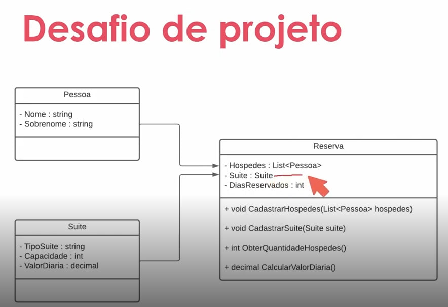

# Sistema de Hospedagem

Neste LAB foi proposto um desafio para construir um sistema de hospedagem, que será usado para realizar uma reserva em um hotel. Você precisará usar a classe Pessoa, que representa o hóspede, a classe Suíte, e a classe Reserva, que fará um relacionamento entre ambos. Seu programa deverá calcular corretamente os valores dos métodos da classe Reserva, que precisará trazer a quantidade de hóspedes e o valor da diária, concedendo um desconto de 10% para caso a reserva seja para um período maior que 10 dias.

## GitHub

Todo código-fonte desenvolvido durante o curso foi versionado no GitHub, no seguinte endereço:
[GitHub - Trilha .NET Explorando Desafio](https://github.com/digitalinnovationone/trilha-net-explorando-desafio)

## Diagrama de Classe



## Como Usar

1. Clone este repositório
   ```bash
   git clone https://github.com/teoalvesp/bootcamp-dio-fullstack/Sistema_Hospedagem_Hotel
   ```
